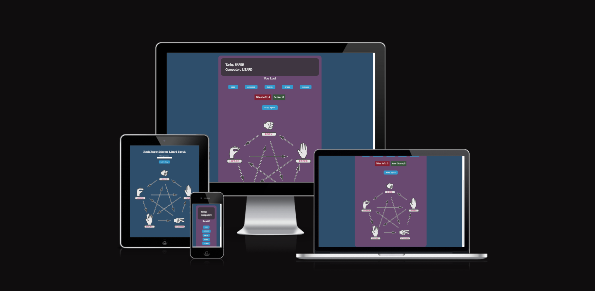
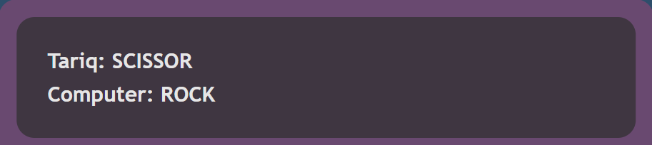
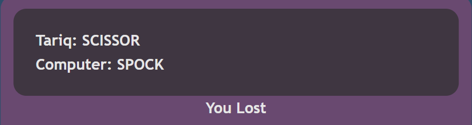

#Rock Paper Scissors Lizard Spock Game.
Javascript Learning Project

## Overview
This project is a web-based implementation of the Rock Paper Scissors Lizard Spock game. The game allows users to play against the computer by selecting one of the available options: Rock, Paper, Scissors, Lizard, or Spock. It aims to provide entertainment and challenge to users with its interactive gameplay and scoring system.

## Index
1. [Purpose of the project](#purpose-of-the-project)
2. [User Stories](#user-stories)
3. [Features](#features)
4. [Future Features](#future-features)
5. [Technology](#technology)
6. [Testing](#testing)
    - [Code Validation](#code-validation)
    - [Accessibility](#accessibility)
    - [Manual Testing](#manual-testing)
    - [Supported Screens and Browsers](#supported-screens-and-browsers)
7. [Deployment](#deployment)
    - [Via GitHub Pages](#via-github-pages)
9. [Credits](#credits)

## Purpose of the Project
The purpose of this project is to create an interactive web-based game that provides entertainment and challenge to users. By implementing the Rock Paper Scissors Lizard Spock game, the project aims to showcase the use of HTML, CSS, and JavaScript to create a fun and engaging user experience.

## User Stories
- As a player, I want to enter my name before starting the game so that I can personalize my gaming experience.
- As a player, I want to be able to make a choice (Rock, Paper, Scissors, Lizard, or Spock) during the game.
- As a player, I want to see the computer's choice and the result of the game after making my choice.
- As a player, I want to keep track of my score during the game.
- As a player, I want the game to end after a limited number of tries.

## Features
- **Username Input**: Users can enter their name before starting the game to personalize their gaming experience.
 
- **Gameplay**: After entering their name, players can choose from Rock, Paper, Scissors, Lizard, or Spock.
 
- **Display of Choices**: The game displays the choices made by the player and the computer, as well as the result of the game.
 
- **Score Tracking**: Players can track their score during the game.
- **Limited Tries**: The game ends after a limited number of tries, providing a challenging experience.
 
- **Play Again**: Players can reset the game and start over with a new username and fresh score.
 

## Future Features
- Multiplayer mode to play against other users online.
- Enhanced graphics and animations for a more engaging experience.
- Ability to customize game settings (e.g., number of tries, difficulty level).

## Design
The design of the game focuses on simplicity and ease of use. Clean layout and intuitive interface elements ensure that players can quickly understand and navigate the game. Color scheme and typography are chosen to create a visually appealing experience while maintaining readability and accessibility.

## Technology
This project uses the following technologies:
- HTML
- CSS
- JavaScript

## Testing
### Code Validation
- HTML: Validated using W3C Markup Validation Service.

- CSS: Validated using W3C CSS Validation Service.

- JavaScript: Checked for syntax errors and logical bugs.

### Accessibility
- Performance, Accessibility, SEO, Best Practices (Lighthouse Chrome DevTools)
 

### Manual Testing
1. **Entering Name**
    - I enter my name in the provided input field.
    - I click on the "Let's Play" button.
      
    - I click on the "Let's Play" button without entring a name and I see an alert asking me to enter my name
        
    - I verify that my name is displayed before the game starts.
        

2. **Making a Choice**
    - I click on one of the buttons (Rock, Paper, Scissors, Lizard, Spock).
    
    - I verify that my choice is displayed on the screen.

3. **Viewing Game Result**
    - After making my choice, I wait for the computer's choice to be displayed.
    - I verify that the result of the game (win, lose, or draw) is displayed.
        
        
        

4. **Tracking Score**
    - After each game, I check the score displayed on the screen.
    - I verify that the score is incremented correctly when I win a game.

5. **Limited Tries**
    - I play multiple games until I run out of tries.
    - I verify that the game ends after the specified number of tries.
        

6. **Play Again**
    - After the game is over, I click on the "Play Again" button.
    - I verify that the game resets, and I can start a new game with a fresh score.
        

### Supported Screens and Browsers
- Desktop: Chrome, Firefox, Safari, Edge
- Mobile: Chrome for Android, Safari for iOS

## Deployment
### Via GitHub Pages
This site was deployed via GitHub pages using the following steps:
- From the GitHub repository, navigate to **Settings**
- In the left-hand navigation section select **Pages**
- From the source section drop-down menu change Branch from **none** to **main** and click the **Save**
- After several minutes the website is live and will be automatically refreshed with each Git push command.

The link to the live site is: https://qav-t.github.io/R-P-S-L-S-GAME/

To run locally:
- Log into GitHub and click on repository to download ([R-P-S-L-S-GAME](https://github.com/QAV-T/R-P-S-L-S-GAME))
- Select **Code** and click "Download the Zip file.
- Once download is completed, extract ZIP file and use in your local environment.

Alternatively you can **Clone** or **Fork** this repository into your GitHub account.

## Credits
###Media
**Image**
- Intro image https://openclipart.org/download/325665/325645re325653re.svg
- I used for editing colors : https://deeditor.com/

**README**
- I looked over this read me file for stracture : https://github.com/Kay-ddggxh/CI-PP2_memory-card-game/blob/main/README.md

**Game Code**
Used a few inspiration for the game ideas and game functionality : 
- https://www.youtube.com/watch?v=qWPtKtYEsN4
- https://github.com/developedbyed/rock-paper-scissor
- https://www.youtube.com/watch?v=n1_vHArDBRA
- https://www.youtube.com/watch?v=3uKdQx-SZ5A&t=898s
- https://github.com/Code-Institute-Solutions/love-maths-2.0-sourcecode

